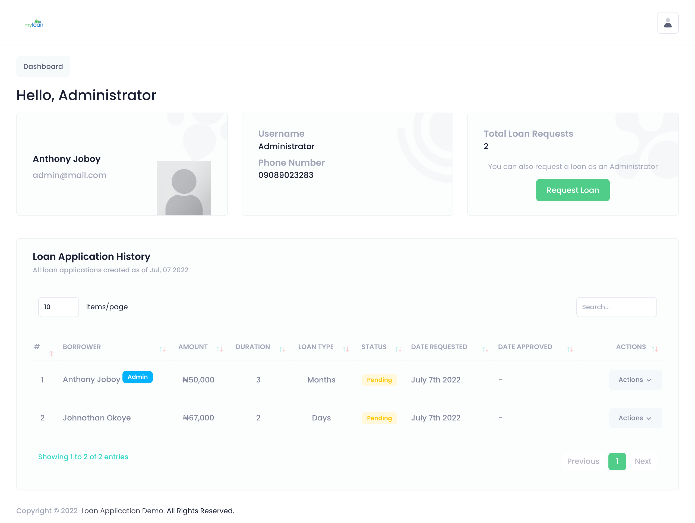

## Loan Demo Application

A simple Laravel CRUD Loan Application for demo purposes.

## About Loan Demo Application

This web application features the following:

1. A login page.
2. A Client dashboard page, where loan applications will be listed.
3. A Client loan application page.
4. An Administrator dashboard.
5. An Administrator loan moderation feature.

## Features Not Included

1. User registration.
2. Forgot password.
3. Profile update.
4. Password change.

## Loan Demo Application Setup

1. CD into the application root directory with your command prompt/terminal/git bash.

2. Run `cp .env.example .env`.

3. Inside `.env` file, setup database, `port number`, mail and other configurations.

4. Run `composer install`.

5. Run `php artisan key:generate` command.

6. Run `php artisan migrate:fresh --seed` command.

7. Run `php artisan serve` command.

8. Define your routes in `web.php`.

9. To run a single migration `php artisan migrate --path=/database/migrations/my_migration.php`.

10. To run single seeder `php artisan db:seed --class=UserSeeder`.

## Login credentials

### Administrator Dashboard

Email: `admin@mail.com`
Password: `password`

### Client Dashboard

Email: `john.doe@gmail.com`
Password: `password`

## Todo List

1. Write test

## Project Screenshots

